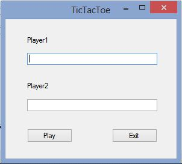
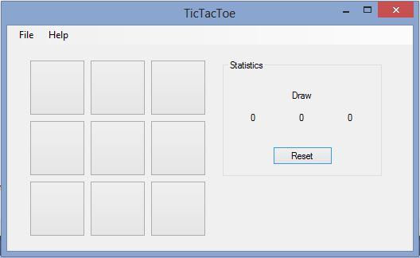
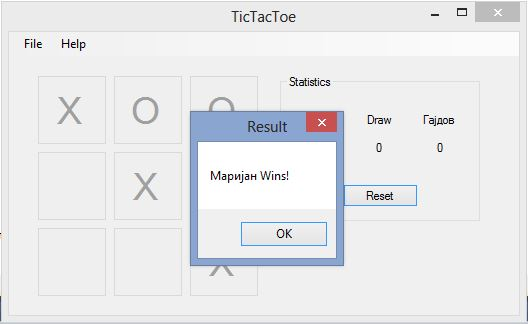
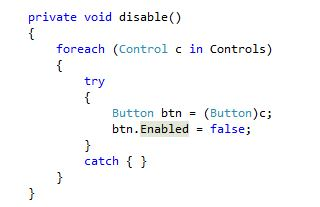
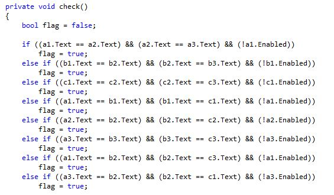
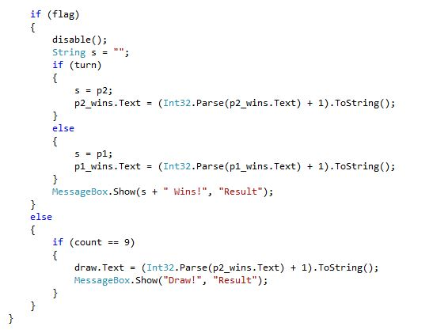

# vp-TicTacToe

### Опис  на проектот
---
За овој проект решив да ја имплементирам играта TicTacToe(Икс Точка). Оваа игра се игра на следниов начин: има два играчи каде што се натпреваруваат еден против друг. Играта има една решетка(grid) која е поделена на 9 дела. Во секој дел(сегмент) играчот го испишува својот симбол(првиот играч е X, а вториот играч е О). Кога ќе се испишат три исти последователни симболи(хоризонтално, вертикално или дијагонално) соодветниот играч победува. Играта може да заврши и нерешено. Играта е turn-based.
### Објаснување на проектот
---
Проектот е направен со две форми.
* Form1 – кога ќе се пушти играта се појавува првата форма на која ни се прикажува две празни TextBox-ови каде што во првиот се внесува името на првиот играч, а во вториот се внесува името на вториот играч. Со притискање на копчето Play се отвара друга форма каде што е играта. Има и друго копче(Exit) и со негово притискање ја исклучиваме апликацијата. Исто така има и опција со која ако се притисне копчето Enter од тастатурата се отвара другата форма каде што е играта.
*	Form2 – кога ќе се појави втората форма се гаси првата форма. На оваа форма се наоѓа игрта. Играта е направена од 9 копчиња кое се еднакви. Секое од тие 9 копчиња го извршува Event-от Universal_Click и во тој евент се повикуваат две фукнции: game() и check().Функцијата game ни кажува кој играч е на ред и што да се испише со кликање на копчето(Х или О). После кликање на копчето, тоа копче станува disabled и не е повеќе во игра. Исто така тука има еден бројач кој ни кажува колку потези биле изиграни. Со функцијата check() ја правиме проверката и дознаваме кој бил резултатот на таа игра. Исто така има опции за чување на статистиката од играта, колку пати победил првиот играч, бториот играч и колку пати играта завршила нерешено. Статистиката моше да се ресетира со копчето Reset. Играта има мени каде што може да почнеме нова игра, можеме да ја исклучиме втората форма и да се вратиме на првата форма.
### Screenshots од  апликацијата
---
* Кога ќе ја пуштиме играта се покажува првата форма каде што се пишуваат имињата на дрвајцата играчи.

* Со притискање на копчето Play одиме на другата форма каде што може да ја играме играта.

* Кога ќе заврши играта се појавува MessageBox каде што ни покажува кој играч победил или дали е нерешено.

### Објаснување на одредени функции
---
Најважните функции во оваа програма се check() – се користи за проверка на кој играч победил и disable() – ако играта заврши со помалку од 9 потези тогаш останатите копчиња што не се кликнати треба да станат disabled.

disable() функцијата работи така што foreach циклусот ги поминува сите контроли на формата и ги конвертираме сите контроли во копчиња и ги правиме disabled.

check() функцијата ја врши проверката за кој победил со едноставни if – else if услови.
